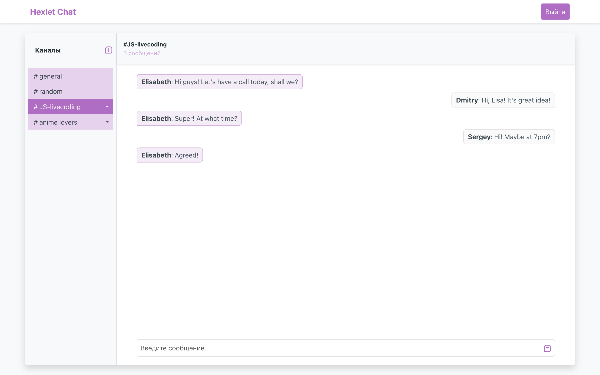

### Hexlet tests and linter status:
[](https://github.com/ElisabethFox/frontend-project-12/actions)

**Hexlet-Chat** is a real-time messaging application.


**About it.** This application includes registration, authorization, error page and chat page itself. Each user has two basic channels and can create, rename and delete their own channels. All registered users can exchange messages, but bad words will be censored.
<code>[Let's try it!](https://frontend-project-12-production-02f1.up.railway.app/)</code> 



<span style="color:#59afe1"> **Developer installation:**</span>
```
1. git clone git@github.com:ElisabethFox/frontend-project-12.git
2. make install
3. npm link
4. make start
```